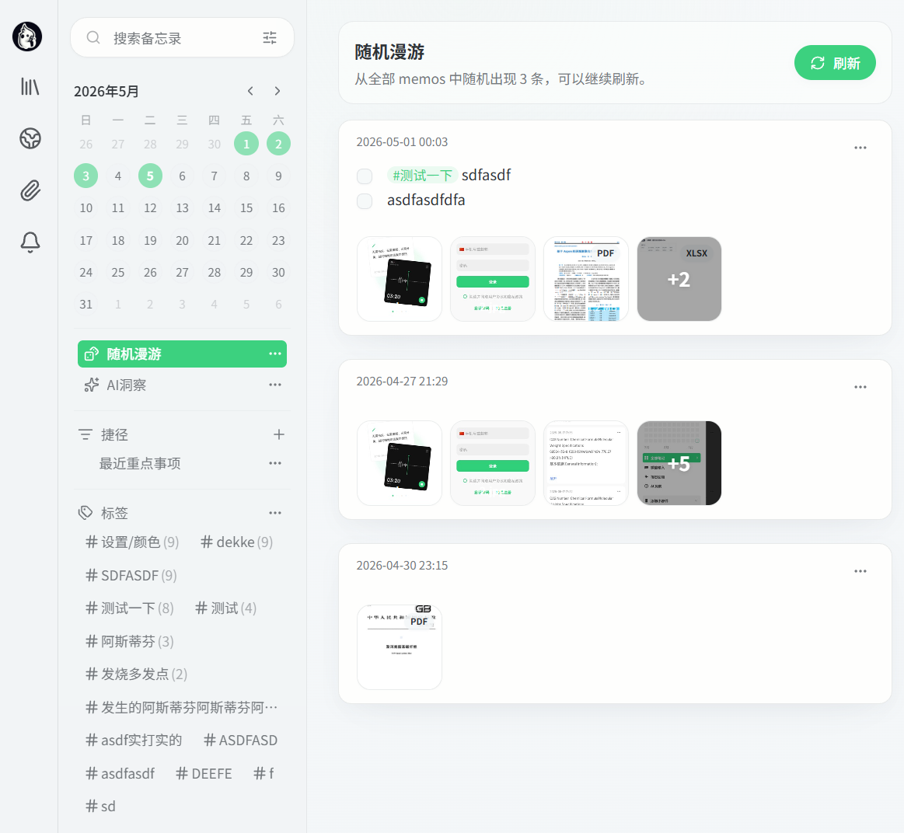
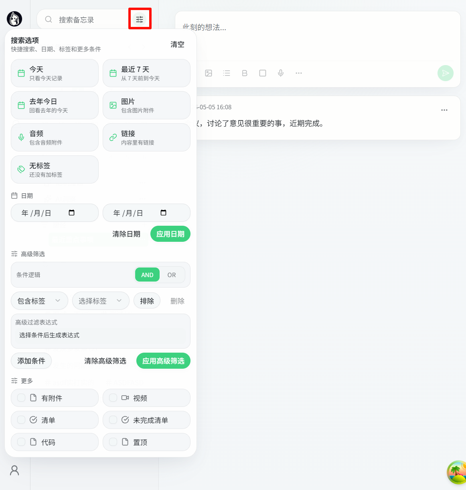
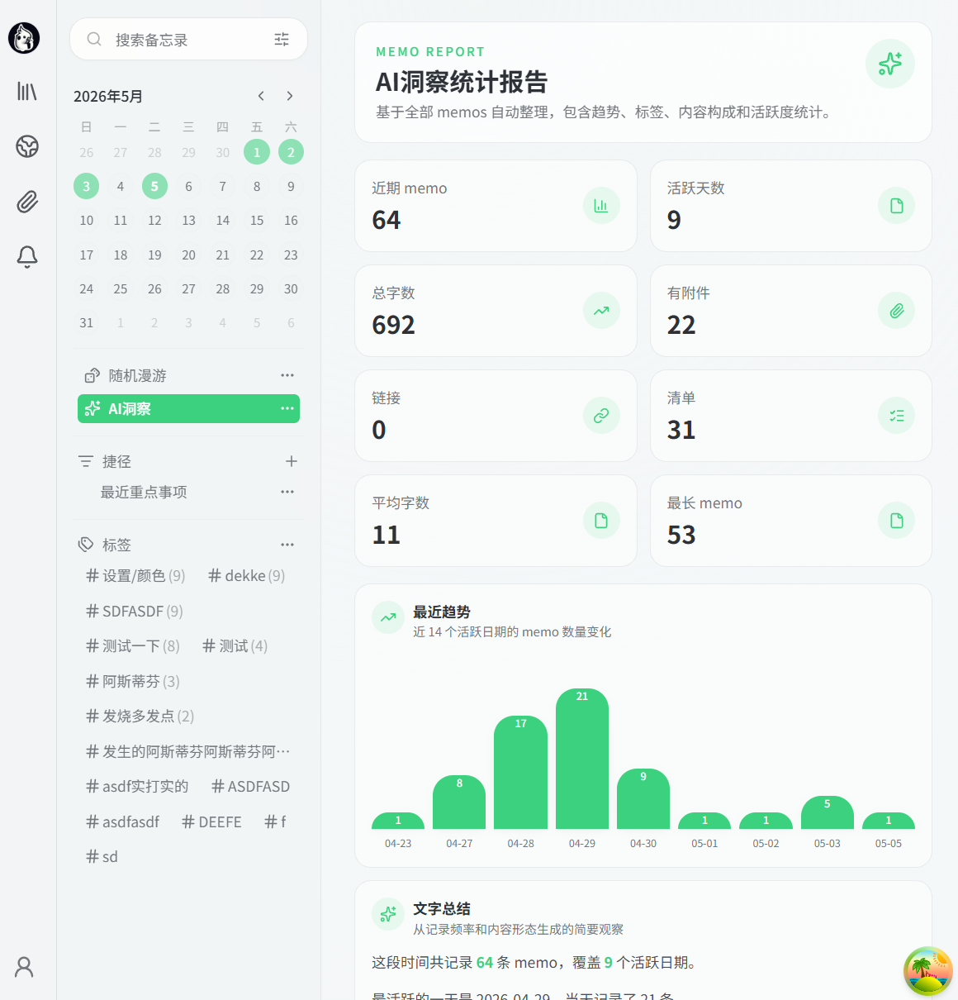
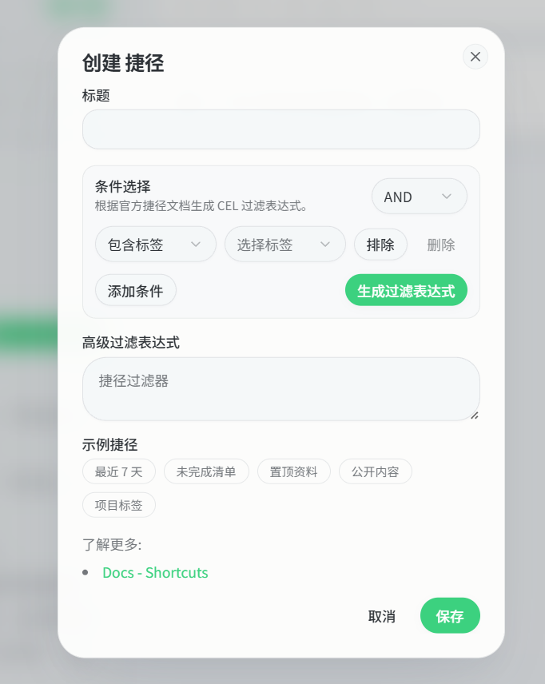
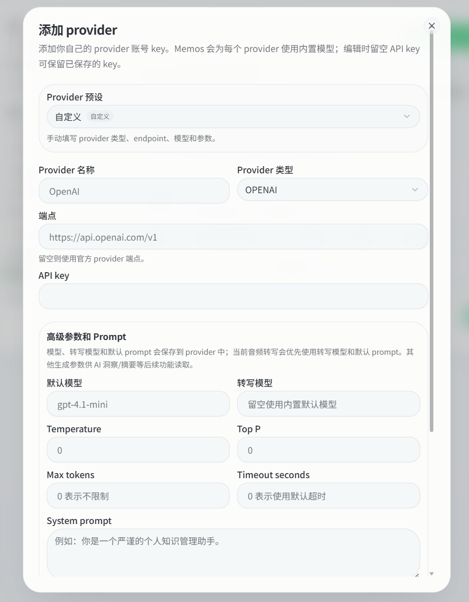
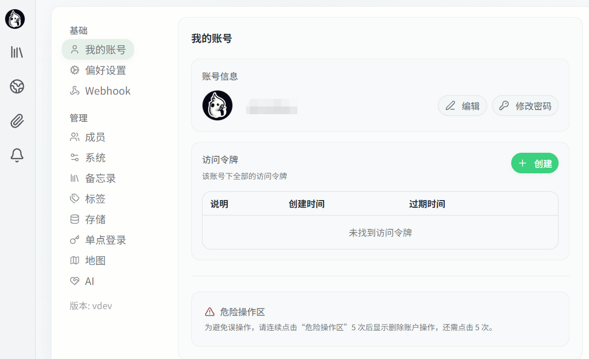

# MemoFlow Server

MemoFlow Server is a customized self-hosted memo and knowledge capture system based on Memos `0.27.1`.

This repository contains both the Go backend and the React frontend. It keeps the upstream Memos 0.27.1 database format so existing 0.27.1 data can be mounted and tested without mixing 0.28 schema changes.

## Screenshots

The screenshots below are from the current MemoFlow interface and show the app's card-based layout, soft green accent color, compact filters, shortcut builder, AI settings, and insight report pages.

| Timeline And Shortcuts | Search Filters |
| --- | --- |
|  |  |

| Random Roaming | AI Insight Report |
| --- | --- |
|  |  |

| Shortcut Builder | AI Provider Settings |
| --- | --- |
|  |  |

| Server Settings |
| --- |
|  |

## Highlights

- Full-stack app: Go backend, React + TypeScript frontend, SQLite/MySQL/PostgreSQL support.
- Memos 0.27.1-compatible database format.
- Enhanced attachment previews for images, videos, PDFs, Office-like documents, audio, and map attachments.
- Amap-based map selection, reverse geocoding, map thumbnails, and profile map views.
- Improved mobile image browsing, including smooth horizontal swipe and swipe-down-to-close.
- Enhanced search options with advanced CEL filtering.
- Random memo roaming and AI insight report pages.
- Synology-friendly Docker packaging with external data volume mapping.

## Quick Start With Docker

The app listens on port `5230`. Runtime data must be mounted to `/var/opt/memos`.

```bash
docker run -d \
  --name memoflow \
  -p 5230:5230 \
  -v /your/data/path:/var/opt/memos \
  memoflow:0.27.1
```

Open:

```text
http://localhost:5230
```

For Synology Container Manager, import the image tar, create a container from `memoflow:0.27.1`, map port `5230`, and map your existing Memos data folder to:

```text
/var/opt/memos
```

Do not bake database files or uploaded assets into the image.

## Data Compatibility

This customized build is intended to stay compatible with Memos `0.27.1` data.

Migration warning for existing Memos users:

- This software only targets the Memos `v0.27.1` database schema.
- If your current Memos instance is older than `v0.27.1`, upgrade it to Memos `v0.27.1` first, confirm it starts normally, and then switch to MemoFlow.
- Back up your database and uploaded assets before any upgrade or switch.
- Do not mount a database that has already been migrated to Memos `0.28` or newer into this image.

Important notes:

- Keep your existing database and attachments outside the image.
- Mount them into `/var/opt/memos`.
- Do not apply or mix Memos 0.28 migrations unless the project is intentionally upgraded later.
- Recommended asset filepath template:

```text
assets/{timestamp}_{filename}
```

## Amap Configuration

Map features support Amap / Gaode Maps.

You can configure keys in the app settings:

- Map Key
- Amap securityJsCode

For environment-based defaults, use:

```bash
VITE_AMAP_WEB_SERVICE_KEY=your_key
VITE_AMAP_JS_API_KEY=your_key
VITE_AMAP_SECURITY_JS_CODE=your_security_js_code
```

Do not commit private keys to the repository.

## Local Development

Backend:

```bash
go run ./cmd/memos --port 8081 --data .dev-data
```

Frontend:

```bash
cd web
pnpm dev
```

The frontend development server runs on port `3001` and proxies API requests to the backend.

Frontend requires Node.js `>=24`. If the local system Node is older, use a Node 24 binary or PATH override.

## Build

Build frontend assets into the backend embed directory:

```bash
cd web
pnpm release
```

Build the backend binary with version `0.27.1`:

```bash
GOCACHE=/tmp/memos-go-cache GOMODCACHE=/tmp/memos-go-mod \
  go build -buildvcs=false -trimpath \
  -ldflags="-s -w -X github.com/usememos/memos/internal/version.Version=0.27.1 -X github.com/usememos/memos/internal/version.Commit=custom -extldflags '-static'" \
  -tags netgo,osusergo \
  -o build/memos ./cmd/memos
```

Verify:

```bash
build/memos version
```

Expected output:

```text
0.27.1
```

## Repository Hygiene

Do not commit:

- `.dev-data/`
- database files
- uploaded attachments
- `web/node_modules/`
- `server/router/frontend/dist/`
- `build/`
- `.env` or `web/.env.local`
- Docker image tar files

## License

This project is based on Memos and keeps the upstream MIT license. See [LICENSE](LICENSE).

## Acknowledgements

Thanks again to these open-source projects:

- [Memos](https://github.com/usememos/memos)
- [MoeMemosAndroid](https://github.com/mudkipme/MoeMemosAndroid)

---

# MemoFlow Server 中文说明

MemoFlow Server 是基于 Memos `0.27.1` 的自托管备忘录和知识记录系统定制版。

本仓库同时包含 Go 后端和 React 前端。当前目标是保持 Memos 0.27.1 数据库格式兼容，方便挂载已有 0.27.1 数据进行测试，不混入 0.28 数据库迁移。

## 界面预览

下面的图片来自当前 MemoFlow 界面，可以直观看到卡片布局、浅色背景、绿色强调色、紧凑筛选器、捷径创建、AI 设置和统计洞察等设计。

| 首页与捷径 | 搜索筛选 |
| --- | --- |
|  |  |

| 随机漫游 | AI 洞察统计 |
| --- | --- |
|  |  |

| 创建捷径 | AI Provider 设置 |
| --- | --- |
|  |  |

| 服务端设置 |
| --- |
|  |

## 主要功能

- 前后端一体：Go 后端，React + TypeScript 前端，支持 SQLite/MySQL/PostgreSQL。
- 保持 Memos 0.27.1 数据格式兼容。
- 增强附件预览：图片、视频、PDF、常见文档、音频、地图附件。
- 集成高德地图：位置选择、逆地理编码、地图缩略图、个人资料地图。
- 优化移动端图片浏览：顺滑左右滑动、下滑关闭。
- 增强搜索选项：支持高级 CEL 筛选。
- 新增随机漫游和 AI 洞察统计报告。
- 适合群晖测试的 Docker 打包方式，运行数据通过外部目录挂载。

## Docker 快速运行

服务端口是 `5230`。运行数据必须挂载到 `/var/opt/memos`。

```bash
docker run -d \
  --name memoflow \
  -p 5230:5230 \
  -v /你的数据目录:/var/opt/memos \
  memoflow:0.27.1
```

访问：

```text
http://localhost:5230
```

如果在群晖 Container Manager 中使用，请导入镜像 tar，使用 `memoflow:0.27.1` 创建容器，映射端口 `5230`，并把已有 Memos 数据目录映射到：

```text
/var/opt/memos
```

不要把数据库和附件打包进镜像。

## 数据兼容说明

当前定制版本面向 Memos `0.27.1` 数据格式。

已有 Memos 用户迁移警告：

- 本软件只适配 Memos `v0.27.1` 版本的数据库结构。
- 如果你当前使用的 Memos 低于 `v0.27.1`，必须先升级到 Memos `v0.27.1`，确认原版 Memos 可以正常启动和读取数据后，再切换到 MemoFlow。
- 升级和切换前，务必先备份数据库和上传附件。
- 不要把已经升级到 Memos `0.28` 或更高版本的数据库直接挂载到这个镜像中。

注意：

- 数据库和附件应放在镜像外部。
- 通过 Docker 挂载到 `/var/opt/memos`。
- 不要混用 Memos 0.28 的迁移文件，除非后续明确升级数据库格式。
- 推荐附件路径模板：

```text
assets/{timestamp}_{filename}
```

## 高德地图配置

地图功能使用高德地图。

可以在应用设置里配置：

- 地图 Key
- 高德安全密钥 securityJsCode

也可以通过环境变量提供默认值：

```bash
VITE_AMAP_WEB_SERVICE_KEY=your_key
VITE_AMAP_JS_API_KEY=your_key
VITE_AMAP_SECURITY_JS_CODE=your_security_js_code
```

不要把私有 Key 提交到仓库。

## 本地开发

后端：

```bash
go run ./cmd/memos --port 8081 --data .dev-data
```

前端：

```bash
cd web
pnpm dev
```

前端开发服务运行在 `3001`，并代理请求到后端。

前端要求 Node.js `>=24`。如果系统 Node 版本较低，请使用 Node 24 或通过 PATH 指定 Node 24。

## 构建

构建前端静态资源：

```bash
cd web
pnpm release
```

构建 0.27.1 后端二进制：

```bash
GOCACHE=/tmp/memos-go-cache GOMODCACHE=/tmp/memos-go-mod \
  go build -buildvcs=false -trimpath \
  -ldflags="-s -w -X github.com/usememos/memos/internal/version.Version=0.27.1 -X github.com/usememos/memos/internal/version.Commit=custom -extldflags '-static'" \
  -tags netgo,osusergo \
  -o build/memos ./cmd/memos
```

验证版本：

```bash
build/memos version
```

应输出：

```text
0.27.1
```

## 仓库提交注意事项

不要提交：

- `.dev-data/`
- 数据库文件
- 上传附件
- `web/node_modules/`
- `server/router/frontend/dist/`
- `build/`
- `.env` 或 `web/.env.local`
- Docker 镜像 tar 文件

## 许可证

本项目基于 Memos，沿用上游 MIT License。详见 [LICENSE](LICENSE)。

## 致谢

再次感谢以下开源项目：

- [Memos](https://github.com/usememos/memos)
- [MoeMemosAndroid](https://github.com/mudkipme/MoeMemosAndroid)
